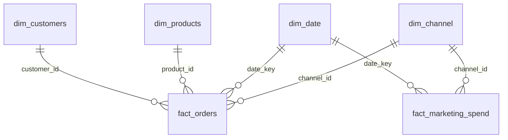
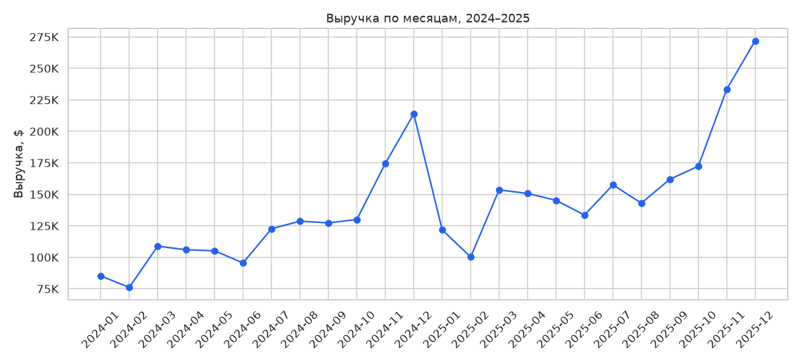
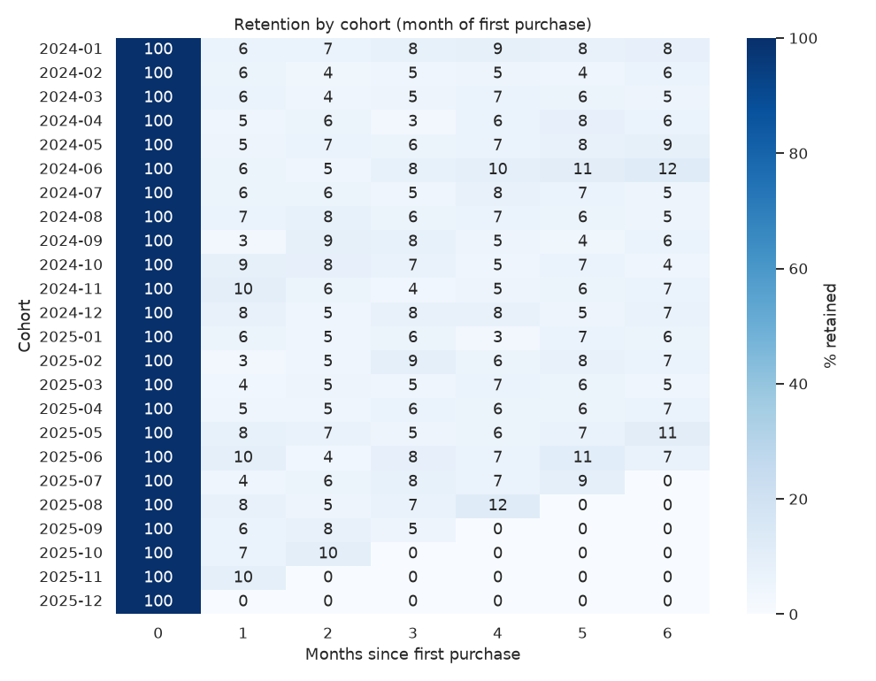
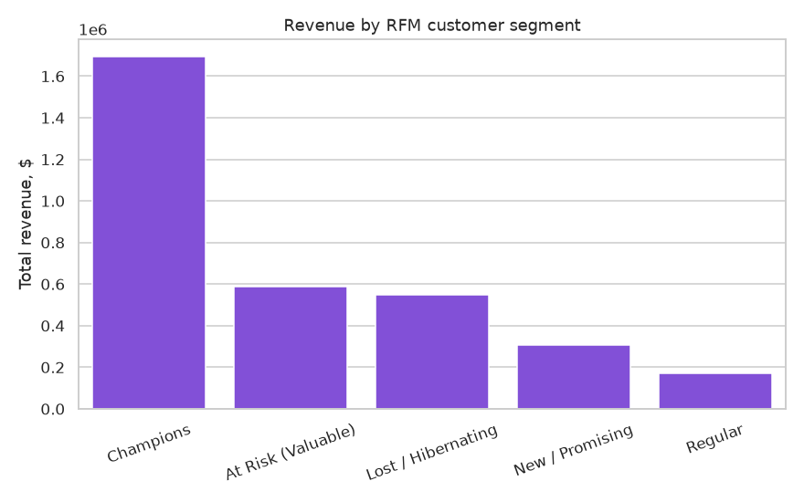
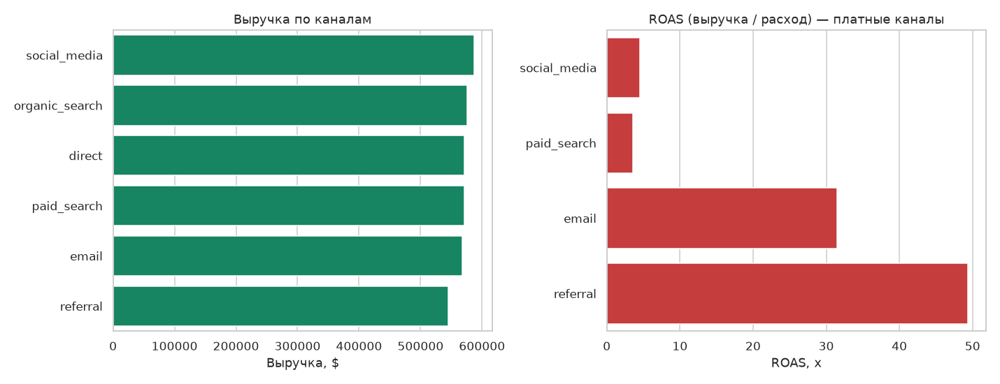

# E-commerce Sales Analytics

An end-to-end Junior+ data analyst portfolio project: from raw "dirty" data
to a dashboard. Demonstrates the full analyst workflow — **Python/pandas**
(data generation and cleaning, EDA) → **SQL** (star schema, business
queries, window functions) → **Power BI** (dashboard, DAX).

> **About the data.** The dataset is synthetic (generated with a
> Faker/NumPy script), but intentionally designed to be realistic: business
> growth over time, seasonality (a sales peak in November-December), a
> Pareto-style distribution of customer purchasing activity (a small share
> of customers drives most of the revenue), plus a full set of typical data
> quality issues (duplicates, missing values, inconsistent date formats,
> incorrect types) — so there's something real to clean. No public dataset
> was used, so the whole pipeline is reproducible offline and doesn't
> depend on the availability of external sources.

## Business problem

An electronics e-commerce store, 2024–2025, wants to understand:

1. How is revenue growing, and is there seasonality?
2. Which products/categories generate the most revenue and margin?
3. Which customers are most valuable (RFM), and how well are they retained?
4. Which marketing channels have the best ROAS?

## Key insights

- **Revenue grew ~32% in 2025** vs. 2024 ($1.47M → $1.95M), with a clear
  seasonal peak in November-December (Black Friday / holiday shopping) and
  a dip in January-February.
- **~20% of customers generate over half of revenue** (51%) — a classic
  Pareto distribution of customer value, the `Champions` segment in the RFM
  analysis. A priority for retention programs and personalized offers.
- **Retention is weak: only ~6% of customers return within the first
  month** after purchase, dropping to single digits by month 6 — a signal
  that the store lacks an effective repeat-purchase / email-trigger
  program.
- **Referral and email are the most efficient paid channels by ROAS** (49x
  and 31x respectively, vs. 3.5–4.5x for paid_search/social_media) —
  marketing budget allocation is worth revisiting in their favor.
- **15% of orders don't complete successfully** (9.4% cancelled + 5.0%
  returned) — a growth area worth investigating further by category /
  payment method.
- The **Accessories** category leads by revenue, but margin should be
  checked (see `sql/business_questions.sql`, questions #4 and #14) to
  prioritize purchasing decisions.

Numbers are computed in `notebooks/04_eda.ipynb` and the SQL queries —
reproducible via the command in the [How to reproduce](#how-to-reproduce)
section.

## Tech stack

| Stage | Tools |
|---|---|
| Data generation & cleaning | Python, pandas, NumPy, Faker |
| Storage / business queries | SQLite, SQL (CTEs, window functions, joins, aggregations) |
| EDA / visualization | pandas, matplotlib, seaborn, Jupyter |
| BI dashboard | Power BI (star schema, DAX, time intelligence) |

## Repository structure

```
Data-Project/
├── python/
│   ├── 01_generate_data.py         # generates synthetic "raw" data
│   ├── 02_clean_data.py            # cleaning: duplicates, missing values, types, date formats
│   ├── 03_build_star_schema.py     # star schema -> SQLite + CSVs for Power BI
│   └── 04_export_powerbi_extras.py # RFM segments and cohort retention for Power BI
├── notebooks/
│   └── 04_eda.ipynb                # exploratory analysis with charts and findings
├── sql/
│   ├── schema.sql                  # star schema DDL
│   └── business_questions.sql      # 16 business queries (RFM, cohorts, YoY, ROAS...)
├── powerbi/
│   ├── README.md                   # step-by-step dashboard build, model, DAX measures
│   └── theme.json                  # Power BI color theme
├── data/
│   ├── raw/                        # raw data with intentional issues (for cleaning practice)
│   ├── processed/                  # cleaned tables
│   ├── powerbi/                    # ready-to-import CSVs for Power BI
│   └── ecommerce.db                # final SQLite database (star schema)
└── reports/
    ├── data_cleaning_report.md     # what was fixed during cleaning, and how
    └── figures/                    # EDA charts (PNG)
```

## Data model (star schema)



`fact_orders` is grained at "order line item", `fact_marketing_spend` at
"day × channel". See `sql/schema.sql` for column types and relationships.

## Charts from the EDA

| Revenue over time | Cohort retention |
|---|---|
|  |  |

| RFM segments | Marketing channels |
|---|---|
|  |  |

Full notebook with code and all charts —
[`notebooks/04_eda.ipynb`](notebooks/04_eda.ipynb).

## SQL

16 business queries in
[`sql/business_questions.sql`](sql/business_questions.sql), covering:
aggregations and `GROUP BY`, multi-table `JOIN`s, CTEs, window functions
(`LAG`, `RANK`, `NTILE`, `SUM() OVER`), `CASE WHEN`, `HAVING`, subqueries.
Example questions: RFM segmentation, cohort retention, MoM / cumulative
revenue, ROAS by channel, customers at risk of churn.

```sql
-- example: month-over-month revenue growth, LAG window function
WITH monthly_revenue AS (
    SELECT d.year_month, SUM(f.line_revenue) AS revenue
    FROM fact_orders f JOIN dim_date d ON f.date_key = d.date_key
    WHERE f.order_status = 'completed'
    GROUP BY d.year_month
)
SELECT year_month, revenue,
       ROUND((revenue - LAG(revenue) OVER (ORDER BY year_month)) * 100.0
             / LAG(revenue) OVER (ORDER BY year_month), 1) AS mom_growth_pct
FROM monthly_revenue ORDER BY year_month;
```

## Power BI

All data is fully prepared in `data/powerbi/` (ready-made star schema +
precomputed RFM segments and cohort retention). The full dashboard-build
guide — relationship model, DAX measures, a 4-page layout — is in
[`powerbi/README.md`](powerbi/README.md). The `.pbix` file isn't included
in the repo (binary format, requires Power BI Desktop on Windows) — the
files and guide let you build the dashboard in 30–60 minutes.

## How to reproduce

```bash
pip install -r requirements.txt

python python/01_generate_data.py           # -> data/raw/*.csv
python python/02_clean_data.py               # -> data/processed/*.csv, reports/data_cleaning_report.md
python python/03_build_star_schema.py        # -> data/ecommerce.db, data/powerbi/*.csv
python python/04_export_powerbi_extras.py    # -> data/powerbi/dim_customer_rfm.csv, fact_cohort_retention.csv

jupyter nbconvert --to notebook --execute --inplace notebooks/04_eda.ipynb
```

SQL queries: open `data/ecommerce.db` with any SQL client (DBeaver,
DataGrip, the SQLite extension for VS Code) and run
`sql/business_questions.sql`.

## Next steps

- Add a revenue forecast (Prophet / statsmodels) based on `dim_date` +
  `fact_orders`.
- A/B-test the effect of a marketing channel on retention.
- Move to PostgreSQL + dbt for a more "production-like" transformation
  pipeline.
