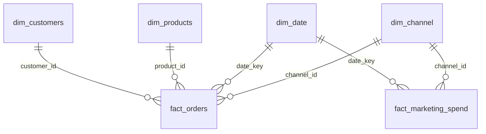

# E-commerce Sales Analytics

Сквозной pet-проект дата-аналитика уровня Junior+: от сырых «грязных» данных
до дашборда. Показывает полный цикл работы аналитика — **Python/pandas**
(генерация и очистка данных, EDA) → **SQL** (звёздная схема, бизнес-запросы,
оконные функции) → **Power BI** (дашборд, DAX).

> **О данных.** Датасет синтетический (сгенерирован скриптом на Faker/NumPy),
> но намеренно спроектирован реалистично: рост бизнеса во времени, сезонность
> (пик продаж в ноябре-декабре), Парето-распределение покупательской
> активности (небольшая доля клиентов даёт основную часть выручки), плюс
> целый набор типичных проблем качества данных (дубли, пропуски, разные
> форматы дат, некорректные типы) — чтобы было что по-настоящему чистить.
> Реальный публичный датасет не использовался, чтобы весь пайплайн был
> воспроизводим оффлайн и не зависел от доступности внешних источников.

## Бизнес-задача

Интернет-магазин электроники за 2024–2025 гг. хочет понять:

1. Как растёт выручка и есть ли сезонность?
2. Какие товары/категории приносят больше всего денег и маржи?
3. Какие клиенты наиболее ценны (RFM) и как хорошо они удерживаются (retention)?
4. Какие маркетинговые каналы окупаются лучше всего (ROAS)?

## Ключевые инсайты

- **Выручка выросла на ~32% в 2025 году** относительно 2024-го ($1.47M → $1.95M),
  с выраженным сезонным пиком в ноябре-декабре (Black Friday / предновогодние покупки)
  и просадкой в январе-феврале.
- **~20% клиентов формируют больше половины выручки** (51%) — классическое
  Парето-распределение ценности клиентов, сегмент `Champions` в RFM-анализе.
  Приоритет для retention-программ и персональных предложений.
- **Retention слабый: только ~6% клиентов возвращаются в первый месяц** после
  покупки, к 6-му месяцу удержание падает до единичных процентов — сигнал,
  что у магазина нет эффективной программы повторных покупок / email-триггеров.
- **Referral и email — самые эффективные платные каналы по ROAS** (49x и 31x
  соответственно против 3.5–4.5x у paid_search/social_media) — стоит
  пересмотреть распределение маркетингового бюджета в их пользу.
- **15% заказов не завершаются успешно** (9.4% отмен + 5.0% возвратов) —
  точка роста: разобраться в причинах через дополнительный анализ по
  категориям/способам оплаты.
- Категория **Accessories** — лидер по выручке, но стоит проверить маржинальность
  (см. `sql/business_questions.sql`, вопрос №4 и №14) для приоритизации закупок.

Цифры получены в `notebooks/04_eda.ipynb` и SQL-запросах — воспроизводимы командой
из раздела [«Как воспроизвести»](#как-воспроизвести).

## Стек

| Этап | Инструменты |
|---|---|
| Генерация и очистка данных | Python, pandas, NumPy, Faker |
| Хранение / бизнес-запросы | SQLite, SQL (CTE, window functions, joins, агрегации) |
| EDA / визуализация | pandas, matplotlib, seaborn, Jupyter |
| BI-дашборд | Power BI (звёздная схема, DAX, time intelligence) |

## Структура репозитория

```
Data-Project/
├── python/
│   ├── 01_generate_data.py         # генерация синтетических "сырых" данных
│   ├── 02_clean_data.py            # очистка: дубли, пропуски, типы, форматы дат
│   ├── 03_build_star_schema.py     # звёздная схема -> SQLite + CSV для Power BI
│   └── 04_export_powerbi_extras.py # RFM-сегменты и cohort retention для Power BI
├── notebooks/
│   └── 04_eda.ipynb                # разведочный анализ с графиками и выводами
├── sql/
│   ├── schema.sql                  # DDL звёздной схемы
│   └── business_questions.sql      # 16 бизнес-запросов (RFM, cohort, YoY, ROAS...)
├── powerbi/
│   ├── README.md                   # пошаговая сборка дашборда, модель, DAX-меры
│   └── theme.json                  # цветовая тема Power BI
├── data/
│   ├── raw/                        # сырые данные с "грязью" (для тренировки очистки)
│   ├── processed/                  # очищенные таблицы
│   ├── powerbi/                    # готовые CSV для импорта в Power BI
│   └── ecommerce.db                # итоговая SQLite база (звёздная схема)
└── reports/
    ├── data_cleaning_report.md     # что и как было исправлено на этапе очистки
    └── figures/                    # графики из EDA (PNG)
```

## Модель данных (звёздная схема)



`fact_orders` — гранулярность "позиция заказа", `fact_marketing_spend` —
"день × канал". Подробности типов и связей — `sql/schema.sql`.

## Графики из EDA

| Динамика выручки | Retention по когортам |
|---|---|
|  |  |

| RFM-сегменты | Маркетинговые каналы |
|---|---|
|  |  |

Полный ноутбук с кодом и всеми графиками — [`notebooks/04_eda.ipynb`](notebooks/04_eda.ipynb).

## SQL

16 бизнес-запросов в [`sql/business_questions.sql`](sql/business_questions.sql),
покрывающих: агрегации и GROUP BY, JOIN нескольких таблиц, CTE, оконные функции
(`LAG`, `RANK`, `NTILE`, `SUM() OVER`), `CASE WHEN`, `HAVING`, подзапросы.
Примеры вопросов: RFM-сегментация, когортный retention, MoM/накопленная
выручка, ROAS по каналам, клиенты в зоне риска оттока.

```sql
-- пример: помесячный рост выручки, оконная функция LAG
WITH monthly_revenue AS (
    SELECT d.year_month, SUM(f.line_revenue) AS revenue
    FROM fact_orders f JOIN dim_date d ON f.date_key = d.date_key
    WHERE f.order_status = 'completed'
    GROUP BY d.year_month
)
SELECT year_month, revenue,
       ROUND((revenue - LAG(revenue) OVER (ORDER BY year_month)) * 100.0
             / LAG(revenue) OVER (ORDER BY year_month), 1) AS mom_growth_pct
FROM monthly_revenue ORDER BY year_month;
```

## Power BI

Все данные подготовлены под ключ в `data/powerbi/` (готовая звёздная схема +
предрасчитанные RFM-сегменты и cohort retention). Полная инструкция по сборке
дашборда — модель связей, DAX-меры, макет из 4 страниц — в
[`powerbi/README.md`](powerbi/README.md). `.pbix` не включён в репозиторий
(бинарный формат, требует Power BI Desktop под Windows) — файлы и гайд
позволяют собрать дашборд за 30–60 минут.

## Как воспроизвести

```bash
pip install -r requirements.txt

python python/01_generate_data.py           # -> data/raw/*.csv
python python/02_clean_data.py               # -> data/processed/*.csv, reports/data_cleaning_report.md
python python/03_build_star_schema.py        # -> data/ecommerce.db, data/powerbi/*.csv
python python/04_export_powerbi_extras.py    # -> data/powerbi/dim_customer_rfm.csv, fact_cohort_retention.csv

jupyter nbconvert --to notebook --execute --inplace notebooks/04_eda.ipynb
```

SQL-запросы: открыть `data/ecommerce.db` любым SQL-клиентом (DBeaver,
DataGrip, встроенное расширение SQLite для VS Code) и выполнить
`sql/business_questions.sql`.

## Дальнейшие шаги

- Добавить прогноз выручки (Prophet / statsmodels) на основе `dim_date` + `fact_orders`.
- A/B-тест влияния маркетингового канала на retention.
- Перейти на PostgreSQL + dbt для более "боевого" пайплайна трансформаций.
