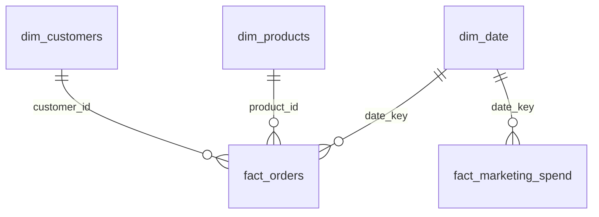

# E-commerce Sales Analytics

A Junior+ data analyst portfolio project built end-to-end from scratch:
**Python/pandas** (synthetic data generation, cleaning) → **SQL** (star
schema in SQLite, business queries with CTEs and window functions) →
**Power BI** (data model, DAX measures, dashboard).

> **About the data.** The dataset is synthetic, generated with a
> Faker/NumPy script and intentionally seeded with realistic data quality
> issues (duplicate customers, missing values, inconsistent date formats,
> a `$`-prefixed price column, negative values, orphaned foreign keys) so
> there's something real to clean. It's a compact, learning-scale dataset
> (100 customers, 30 products, 500 orders) rather than a large production
> volume — the parameters in `python/generate_data.py` (`n` in each
> `generate_*` call) can be scaled up if a bigger dataset is needed.

## Business problem

An electronics e-commerce store wants to understand:

1. How much revenue is it generating, and what's the average order size?
2. Which products sell best?
3. Which categories carry the highest prices/margins?

## What the data shows

- **~$126K total revenue** across **430 completed orders**, average order
  value **~$293**.
- Top-selling product by revenue: **Tablets Guy Lite**.
- **Gaming** has the most SKUs (14 of 30 products); **Electronics** carries
  the highest average price per item.

(Numbers reproducible via `sql/business_questions.sql`, queries 1–7, or
the equivalent DAX measures in the Power BI model.)

## Tech stack

| Stage | Tools |
|---|---|
| Data generation & cleaning | Python, pandas, NumPy, Faker |
| Storage / business queries | SQLite, SQL (CTEs, window functions, joins, aggregations) |
| BI dashboard | Power BI (star schema, DAX) |

## Repository structure

```
Data-Project/
├── python/
│ ├── generate_data.py # synthetic "raw" data: customers, products, orders, order_items
│ ├── clean_data.py # cleaning: duplicates, missing values, types, date formats
│ └── build_star_schema.py # star schema -> SQLite (data/ecommerce.db) + CSVs for Power BI
├── sql/
│ ├── schema.sql # star schema DDL
│ └── business_questions.sql # business queries: aggregations, JOINs, CTEs, LAG/RANK/NTILE
├── powerbi/
│ └── README.md # data model, relationships, DAX measures, how the dashboard was built
├── data/
│ ├── raw/ # raw generated data (with intentional issues)
│ ├── processed/ # cleaned tables
│ ├── powerbi/ # CSVs exported for Power BI import
│ └── ecommerce.db # SQLite database (star schema)
└── requirements.txt
```

## Data model (star schema)



fact_orders is grained at "order line item". dim_channel exists as a
standalone dimension (channel names from dim_customers.acquisition_channel)
but isn't yet wired into the fact tables — see powerbi/README.md for why.
Full column list and types are in sql/schema.sql.


## SQL

Business queries in sql/business_questions.sql,
covering GROUP BY aggregations, multi-table JOINs, CTEs (WITH), and
window functions (LAG, RANK, NTILE).

```sql
-- example: month-over-month revenue growth, LAG window function
WITH monthly_revenue AS (
    SELECT d.year, d.month, ROUND(SUM(f.line_revenue), 2) AS revenue
    FROM fact_orders f JOIN dim_date d ON f.date_key = d.date_key
    WHERE f.status = 'completed'
    GROUP BY d.year, d.month
)
SELECT year, month, revenue,
       ROUND((revenue - LAG(revenue) OVER (ORDER BY year, month)) * 100.0
             / LAG(revenue) OVER (ORDER BY year, month), 1) AS mom_growth_pct
FROM monthly_revenue ORDER BY year, month;
```

## Power BI

Data is exported to data/powerbi/ as flat CSVs ready to import. The
dashboard currently has one page (Overview): KPI cards for total revenue,
order count and average order value, a monthly revenue trend chart, and a
top-10-products-by-revenue chart. Full build steps — relationships, DAX
measures, and a couple of gotchas hit along the way (Power BI's automatic
date hierarchy, a data-type/formatting bug on one measure) — are in
powerbi/README.md. The .pbix file isn't included
in the repo (binary format, requires Power BI Desktop).

## How to reproduce

```bash
pip install -r requirements.txt

python python/generate_data.py       # -> data/raw/*.csv
python python/clean_data.py          # -> data/processed/*.csv
python python/build_star_schema.py   # -> data/ecommerce.db, data/powerbi/*.csv
```

SQL queries: open data/ecommerce.db with any SQL client (DBeaver,
DataGrip, the SQLite extension for VS Code, or PyCharm's built-in
Database tool) and run sql/business_questions.sql.

## Next steps

- Add a channel_id to orders so dim_channel connects to the star schema
properly, and build a marketing/ROAS page.
- Add customer-level RFM segmentation and cohort retention (SQL and/or
Power BI).
- Scale up the generated dataset (more customers/orders) for a richer
dashboard.
