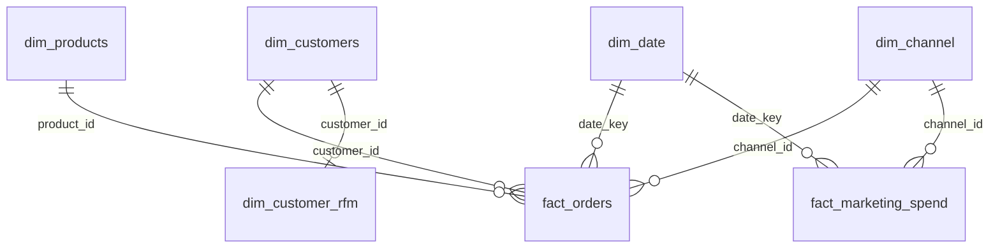

# Power BI: building the dashboard

All the data for Power BI is already prepared and sitting in
`data/powerbi/` as flat CSVs — nothing to process, just import and
relate. The `.pbix` file isn't stored in the repository (binary format,
requires Power BI Desktop on Windows) — this document is a step-by-step
blueprint the dashboard can be built from in 30–60 minutes.

## 1. Tables to import

| File | Role | Grain |
|---|---|---|
| `dim_customers.csv` | "Customers" dimension | 1 row = 1 customer |
| `dim_products.csv` | "Products" dimension | 1 row = 1 product |
| `dim_channel.csv` | "Channel" dimension | 1 row = 1 channel |
| `dim_date.csv` | "Date" dimension | 1 row = 1 day, 2023-01-01…2025-12-31 |
| `dim_customer_rfm.csv` | customer RFM segment (precomputed in pandas) | 1 row = 1 customer |
| `fact_orders.csv` | sales fact | 1 row = 1 order line item |
| `fact_marketing_spend.csv` | marketing spend fact | 1 row = day × channel |
| `fact_cohort_retention.csv` | cohort retention table (precomputed) | 1 row = cohort × months since first purchase |

**Get Data → Text/CSV** → select all 8 files from `data/powerbi/` → Load.
In Power Query, check that data types were inferred correctly: `date` and
`registration_date` → Date, `is_weekend` → True/False, ID columns → Whole
Number.

## 2. Data model (relationships)



In **Model view**, create these relationships (all `1 → *` / `1 → 1`,
Single filter direction, from dim to fact):

1. `dim_customers[customer_id]` → `fact_orders[customer_id]`
2. `dim_products[product_id]` → `fact_orders[product_id]`
3. `dim_date[date_key]` → `fact_orders[date_key]`
4. `dim_channel[channel_id]` → `fact_orders[channel_id]`
5. `dim_date[date_key]` → `fact_marketing_spend[date_key]`
6. `dim_channel[channel_id]` → `fact_marketing_spend[channel_id]`
7. `dim_customers[customer_id]` → `dim_customer_rfm[customer_id]` (1:1)

Don't connect `fact_cohort_retention` to the star — it's a standalone
aggregated table, meant to be used directly in a matrix/heatmap visual.

## 3. Setting dim_date as the date table

`dim_date` → **Table tools → Mark as date table** → column `date`. This
enables correct time intelligence (`SAMEPERIODLASTYEAR`, `DATEADD`, etc.).

## 4. DAX measures

Create these in a dedicated measures table (New Table → `_Measures`, an
empty table with no rows, used only as a folder for measures).

```dax
Total Revenue =
CALCULATE(SUM(fact_orders[line_revenue]), fact_orders[order_status] = "completed")

Total Orders =
CALCULATE(DISTINCTCOUNT(fact_orders[order_id]), fact_orders[order_status] = "completed")

Average Order Value = DIVIDE([Total Revenue], [Total Orders])

Estimated Profit =
CALCULATE(
    SUMX(
        fact_orders,
        fact_orders[quantity] * (fact_orders[unit_price] * (1 - fact_orders[discount]) - RELATED(dim_products[cost]))
    ),
    fact_orders[order_status] = "completed"
)

Profit Margin % = DIVIDE([Estimated Profit], [Total Revenue])

Revenue LY = CALCULATE([Total Revenue], SAMEPERIODLASTYEAR(dim_date[date]))
YoY Growth % = DIVIDE([Total Revenue] - [Revenue LY], [Revenue LY])

Revenue Prev Month = CALCULATE([Total Revenue], DATEADD(dim_date[date], -1, MONTH))
MoM Growth % = DIVIDE([Total Revenue] - [Revenue Prev Month], [Revenue Prev Month])

Cumulative Revenue =
CALCULATE([Total Revenue], FILTER(ALLSELECTED(dim_date[date]), dim_date[date] <= MAX(dim_date[date])))

Total Marketing Spend = SUM(fact_marketing_spend[spend])
ROAS = DIVIDE([Total Revenue], [Total Marketing Spend])

Repeat Customers =
CALCULATE(
    DISTINCTCOUNT(fact_orders[customer_id]),
    FILTER(
        VALUES(fact_orders[customer_id]),
        CALCULATE(DISTINCTCOUNT(fact_orders[order_id]), fact_orders[order_status] = "completed") > 1
    ),
    fact_orders[order_status] = "completed"
)
Total Customers (with orders) =
CALCULATE(DISTINCTCOUNT(fact_orders[customer_id]), fact_orders[order_status] = "completed")

Repeat Purchase Rate % = DIVIDE([Repeat Customers], [Total Customers (with orders)])

Cancelled/Returned Rate % =
VAR TotalOrders = DISTINCTCOUNT(fact_orders[order_id])
VAR BadOrders = CALCULATE(DISTINCTCOUNT(fact_orders[order_id]), fact_orders[order_status] IN {"cancelled", "returned"})
RETURN DIVIDE(BadOrders, TotalOrders)
```

These measures already filter `order_status = "completed"` wherever it
matters for revenue/profit — a separate report-level status filter isn't
required, but it's useful on the page that breaks orders down by status.

## 5. Dashboard structure (pages)

**Page 1 — Overview.**
KPI cards: Total Revenue, Total Orders, Average Order Value, YoY Growth %.
Line chart of `Total Revenue` by `dim_date[year_month]`. A map or bar chart
of revenue by `dim_customers[country]`. Slicers at the top: date range,
`channel_name`.

**Page 2 — Sales & Products.**
Bar chart of the top 10 products by revenue (`dim_products[product_name]`
× `Total Revenue`). Treemap/bar by `category`. A `category` ×
`subcategory` matrix with `Total Revenue` and `Profit Margin %`,
conditional formatting (data bars) on margin.

**Page 3 — Customers & RFM.**
Scatter chart: X axis — `recency_days`, Y axis — `frequency`, size —
`monetary`, color — `rfm_segment` (from `dim_customer_rfm`). Bar chart of
`monetary` summed by `rfm_segment`. Retention matrix/heatmap: rows —
`cohort_month`, columns — `month_offset`, value — `retention_pct` from
`fact_cohort_retention` (conditional formatting, color scale). Cards:
`Repeat Purchase Rate %`.

**Page 4 — Marketing.**
Combo chart: columns for `Total Marketing Spend`, line for `Total
Revenue`, by month, with `channel_name` in the legend. Bar chart of `ROAS`
by channel (paid channels only — exclude `organic_search`/`direct` via a
visual-level filter). Slicer: `channel_name`.

## 6. Styling

- A single color theme: `powerbi/theme.json` — import via **View → Themes
  → Browse for themes**.
- Number formatting: revenue/profit — `$ #,##0`, percentages — `0.0%`.
- On every page, a title and one sentence stating the key takeaway (see
  the root `README.md`, "Key insights" section) — this is exactly what
  interviewers tend to ask: "so what does the dashboard tell the
  business?"
