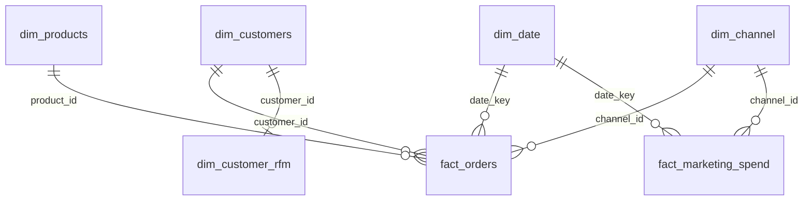

# Power BI: сборка дашборда

Все данные для Power BI уже подготовлены и лежат в `data/powerbi/` в виде
плоских CSV — их не нужно ничем обрабатывать, только импортировать и
связать. Файл `.pbix` в репозитории не хранится (бинарный формат, требует
Power BI Desktop под Windows) — этот документ является пошаговым чертежом,
по которому дашборд собирается за 30–60 минут.

## 1. Таблицы для импорта

| Файл | Роль | Гранулярность |
|---|---|---|
| `dim_customers.csv` | измерение "Клиенты" | 1 строка = 1 клиент |
| `dim_products.csv` | измерение "Товары" | 1 строка = 1 товар |
| `dim_channel.csv` | измерение "Канал" | 1 строка = 1 канал |
| `dim_date.csv` | измерение "Дата" | 1 строка = 1 день, 2023-01-01…2025-12-31 |
| `dim_customer_rfm.csv` | RFM-сегмент клиента (предрасчитан в pandas) | 1 строка = 1 клиент |
| `fact_orders.csv` | факт продаж | 1 строка = 1 позиция заказа |
| `fact_marketing_spend.csv` | факт расходов на маркетинг | 1 строка = день × канал |
| `fact_cohort_retention.csv` | таблица retention по когортам (предрасчитана) | 1 строка = когорта × месяц с первой покупки |

**Get Data → Text/CSV** → выбрать все 8 файлов из `data/powerbi/` → Load.
Проверить в Power Query, что типы данных подхватились верно: `date`
и `registration_date` → Date, `is_weekend` → True/False, ID-колонки → Whole Number.

## 2. Модель данных (связи)



В **Model view** создать связи (все `1 → *` / `1 → 1`, направление фильтрации
Single, от dim к fact):

1. `dim_customers[customer_id]` → `fact_orders[customer_id]`
2. `dim_products[product_id]` → `fact_orders[product_id]`
3. `dim_date[date_key]` → `fact_orders[date_key]`
4. `dim_channel[channel_id]` → `fact_orders[channel_id]`
5. `dim_date[date_key]` → `fact_marketing_spend[date_key]`
6. `dim_channel[channel_id]` → `fact_marketing_spend[channel_id]`
7. `dim_customers[customer_id]` → `dim_customer_rfm[customer_id]` (1:1)

`fact_cohort_retention` со звездой не связываем — это самостоятельная
агрегированная таблица, использовать её напрямую в матрице/heatmap-визуале.

## 3. Настройка dim_date как таблицы дат

`dim_date` → вкладка **Table tools → Mark as date table** → колонка `date`.
Это включит корректную time intelligence (`SAMEPERIODLASTYEAR`, `DATEADD` и т.д.).

## 4. DAX-меры

Создать в отдельной вспомогательной таблице мер (New Table → `_Measures`,
пустая таблица без строк, используется только как папка для мер).

```dax
Total Revenue =
CALCULATE(SUM(fact_orders[line_revenue]), fact_orders[order_status] = "completed")

Total Orders =
CALCULATE(DISTINCTCOUNT(fact_orders[order_id]), fact_orders[order_status] = "completed")

Average Order Value = DIVIDE([Total Revenue], [Total Orders])

Estimated Profit =
CALCULATE(
    SUMX(
        fact_orders,
        fact_orders[quantity] * (fact_orders[unit_price] * (1 - fact_orders[discount]) - RELATED(dim_products[cost]))
    ),
    fact_orders[order_status] = "completed"
)

Profit Margin % = DIVIDE([Estimated Profit], [Total Revenue])

Revenue LY = CALCULATE([Total Revenue], SAMEPERIODLASTYEAR(dim_date[date]))
YoY Growth % = DIVIDE([Total Revenue] - [Revenue LY], [Revenue LY])

Revenue Prev Month = CALCULATE([Total Revenue], DATEADD(dim_date[date], -1, MONTH))
MoM Growth % = DIVIDE([Total Revenue] - [Revenue Prev Month], [Revenue Prev Month])

Cumulative Revenue =
CALCULATE([Total Revenue], FILTER(ALLSELECTED(dim_date[date]), dim_date[date] <= MAX(dim_date[date])))

Total Marketing Spend = SUM(fact_marketing_spend[spend])
ROAS = DIVIDE([Total Revenue], [Total Marketing Spend])

Repeat Customers =
CALCULATE(
    DISTINCTCOUNT(fact_orders[customer_id]),
    FILTER(
        VALUES(fact_orders[customer_id]),
        CALCULATE(DISTINCTCOUNT(fact_orders[order_id]), fact_orders[order_status] = "completed") > 1
    ),
    fact_orders[order_status] = "completed"
)
Total Customers (with orders) =
CALCULATE(DISTINCTCOUNT(fact_orders[customer_id]), fact_orders[order_status] = "completed")

Repeat Purchase Rate % = DIVIDE([Repeat Customers], [Total Customers (with orders)])

Cancelled/Returned Rate % =
VAR TotalOrders = DISTINCTCOUNT(fact_orders[order_id])
VAR BadOrders = CALCULATE(DISTINCTCOUNT(fact_orders[order_id]), fact_orders[order_status] IN {"cancelled", "returned"})
RETURN DIVIDE(BadOrders, TotalOrders)
```

Готовые меры уже фильтруют `order_status = "completed"` там, где это важно
для выручки/прибыли — отдельный отчётный фильтр по статусу не обязателен,
но полезен на странице с разбивкой по статусам.

## 5. Структура дашборда (страницы)

**Стр. 1 — Overview.**
KPI-карточки: Total Revenue, Total Orders, Average Order Value, YoY Growth %.
Линейный график `Total Revenue` по `dim_date[year_month]`. Карта или bar chart
выручки по `dim_customers[country]`. Слайсеры сверху: диапазон дат, `channel_name`.

**Стр. 2 — Продажи и товары.**
Bar chart топ-10 товаров по выручке (`dim_products[product_name]` × `Total Revenue`).
Treemap/bar по `category`. Матрица `category` × `subcategory` с `Total Revenue` и
`Profit Margin %`, условное форматирование (data bars) на марже.

**Стр. 3 — Клиенты и RFM.**
Scatter chart: ось X — `recency_days`, ось Y — `frequency`, размер — `monetary`,
цвет — `rfm_segment` (из `dim_customer_rfm`). Bar chart суммы `monetary` по
`rfm_segment`. Матрица/heatmap retention: строки — `cohort_month`, столбцы —
`month_offset`, значение — `retention_pct` из `fact_cohort_retention`
(условное форматирование Color scale). Карточки: `Repeat Purchase Rate %`.

**Стр. 4 — Маркетинг.**
Комбо-график: столбцы `Total Marketing Spend`, линия `Total Revenue`, по месяцам
и `channel_name` в легенде. Bar chart `ROAS` по каналам (только платные —
исключить `organic_search`/`direct` через фильтр визуала). Слайсер `channel_name`.

## 6. Оформление

- Единая цветовая тема: `powerbi/theme.json` — импортировать через
  **View → Themes → Browse for themes**.
- Формат чисел: выручка/прибыль — `$ #,##0`, проценты — `0.0%`.
- На каждой странице — заголовок и одно предложение с ключевым выводом
  (см. `README.md` в корне, раздел "Ключевые инсайты") — это то, что
  обычно спрашивают на собеседовании: "а что дашборд показывает бизнесу?".
