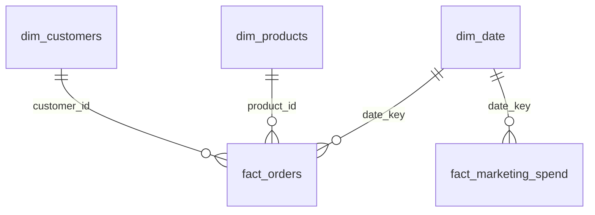

# Power BI: building the dashboard

Data for Power BI is exported from the star schema as flat CSVs in
`data/powerbi/` (see `python/build_star_schema.py`) — import and relate,
no extra processing needed. The `.pbix` file isn't stored in the
repository (binary format, requires Power BI Desktop) — this document
describes the model and measures so the dashboard can be rebuilt from
scratch.

## 1. Tables to import

| File | Role | Grain |
|---|---|---|
| `dim_customers.csv` | "Customers" dimension | 1 row = 1 customer |
| `dim_products.csv` | "Products" dimension | 1 row = 1 product |
| `dim_channel.csv` | "Channel" dimension | 1 row = 1 channel |
| `dim_date.csv` | "Date" dimension | 1 row = 1 day |
| `fact_orders.csv` | sales fact | 1 row = 1 order line item |
| `fact_marketing_spend.csv` | marketing spend fact | 1 row = day × channel |

**Get Data → Text/CSV** → select all 6 files from `data/powerbi/` → Load.

## 2. Data model (relationships)



In **Model view**, create these relationships (all `1 → *` / `1 → 1`,
Single filter direction, from dim to fact):

1. `dim_customers[customer_id]` → `fact_orders[customer_id]`
2. `dim_products[product_id]` → `fact_orders[product_id]`
3. `dim_date[date_key]` → `fact_orders[date_key]`
4. `dim_date[date_key]` → `fact_marketing_spend[date_key]`

dim_channel is not linked to the fact tables — fact_orders has no
channel_id column (order-level channel wasn't tracked in this version
of the generator), only dim_customers[acquisition_channel] records the
channel as text. Left unconnected for now; a future improvement would be
adding a channel_id to orders and wiring dim_channel into the star
properly.

## 3. Setting dim_date as the date table

`dim_date` → **Table tools → Mark as date table** → column `date`. This
enables correct time intelligence (`SAMEPERIODLASTYEAR`, `DATEADD`, etc.).

## 4. DAX measures

Created directly on fact_orders (no separate measures table yet):

```dax
Total revenue =
CALCULATE(SUM(fact_orders[line_revenue]), fact_orders[status] = "completed")

Total orders =
CALCULATE(DISTINCTCOUNT(fact_orders[order_id]), fact_orders[status] = "completed")

Average order value = DIVIDE([Total revenue], [Total orders])
```

All three filter to status = "completed", so cancelled/returned orders
don't distort revenue and order counts.

## 5. Dashboard structure (pages)

**Page 1 — Overview** (built):
- KPI cards: `Total revenue`, `Average order value`, `Total orders`.
- Line/area chart of `Total revenue` by `year_month` (a text column on
  `dim_date` formatted as `"YYYY-MM"`, used instead of the built-in date
  hierarchy — see note below).
- Bar chart of the top 10 products by `Total revenue`
  (`dim_products[product_name]`), filtered with a **Top N** visual-level
  filter (N = 10, by `Total revenue`).

**Possible next pages** (not built yet):
- Customers — revenue/order count by country, top customers by revenue.
- Marketing — spend vs. revenue by channel, ROAS.
- Slicers (date range, category) across pages.

### Why `year_month` instead of the `date` column directly

Putting `dim_date[date]` on an axis pulls in Power BI's automatic Year →
Quarter → Month → Day hierarchy, which needs drill-up/drill-down
navigation and kept collapsing to the wrong level while formatting this
chart. Adding a plain text column to `dim_date`,

```python
dim_date["year_month"] = dim_date["date"].dt.strftime("%Y-%m")
```

## 6. Styling

No custom theme applied yet — using Power BI's default. A shared color
theme (powerbi/theme.json) is a reasonable next step if more pages are
added, to keep colors consistent across visuals.
